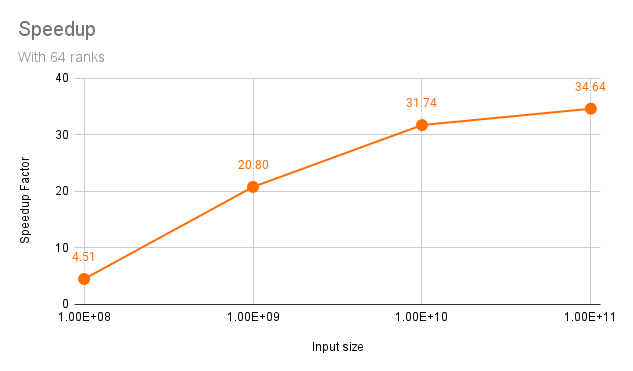

Team collaboration of Hendrik Munske and Florian Neururer

## Sequential Implementation

| N         | Time (s) | $\pi$    |
| --------- | -------- | -------- |
| $10^8$    | 0.275    | 3.141687 |
| $10^9$    | 2.746    | 3.141586 |
| $10^{10}$ | 27.487   | 3.141602 |
| $10^{11}$ | 276.299  | 3.141593 |

## Parallelization Strategy

A straightforward way to parallelize is to divide the number of samples among all the available ranks. Each rank would then compute its own subset of points, keeping track of how many fall within the circle. At the end, the counts from each rank could be summed up by a master rank to compute the final value of π.

### Communication Pattern

- Point-to-Point: Each rank can send its count to the master rank, which will then sum up all counts to compute π.

- Collective Communication: We can gather all counts at the master rank using MPI_Reduce an in the reduce call tell MPI to already sum up the values.

In this task we chose to use **Collective Communication** becasue it seems more efficient than point-to-point communication for this problem since none of the synchronisation and final calculation has to be implemented by ourself and instead we can rely on the optimized implementation of MPI.

### Parallel Performance

| N         | Time (s) | $\pi$    |
| --------- | -------- | -------- |
| $10^8$    | 0.061    | 3.141630 |
| $10^9$    | 0.132    | 3.141590 |
| $10^{10}$ | 0.866    | 3.141575 |
| $10^{11}$ | 7.976    | 3.141598 |
| $10^{12}$ | 79.379   | 3.141594 |
| $10^{13}$ | 791.921  | 4.141593 |

## Obeservations and Implications

1. **Speedup**: The most obvious benefit is the achieved speedup. With lower input sizes like for example when executing with $N=10^9$ this actually results in lower overall execution time of the prgram. The numbers in the table represent only the calculation time within the program after all the MPI setup has complete. If we run the same with the command:

   `time pi_seq 100000000` = 0.279s\
   `time mpiexec pi_mpi 100000000` = 0.823s

   Here we can see that just parallelizing a program can add some overhead if the calculations are not the expensive. Thus especially for lower problem sizes parallelizing can reduce performance.

2. **Non-Linear Speedup**: Due to several overheads we can't see a linear speedup with the number of processors.
   In the chart below we can see the speedup. As we increase the problem size the relative overhead gets smaller and we can observe better scaling but it is still not close to 64.
   
