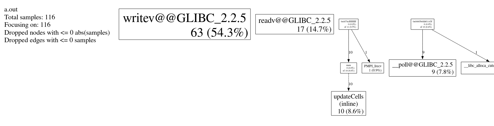

## 1D Heat Stencil

#### perf stat

This is the output of `perf stat` of one node when running the 1D Heat stencil with `N=2048` and 4 ranks.
```
Performance counter stats for './heat_stencil_1D_mpi 2048':

            321.03 msec task-clock:u              #    0.623 CPUs utilized          
                 0      context-switches:u        #    0.000 /sec                   
                 0      cpu-migrations:u          #    0.000 /sec                   
             2,487      page-faults:u             #    7.747 K/sec                  
       822,551,948      cycles:u                  #    2.562 GHz                      (83.96%)
       355,917,160      stalled-cycles-frontend:u #   43.27% frontend cycles idle     (83.98%)
       197,555,946      stalled-cycles-backend:u  #   24.02% backend cycles idle      (65.27%)
     1,520,524,739      instructions:u            #    1.85  insn per cycle         
                                                  #    0.23  stalled cycles per insn  (82.64%)
       276,487,757      branches:u                #  861.246 M/sec                    (83.61%)
         1,313,382      branch-misses:u           #    0.48% of all branches          (83.21%)

       0.515709212 seconds time elapsed

       0.276931000 seconds user
       0.045040000 seconds sys
```

#### perf record

When profiling the program with `perf record` and the analyzing with `perf reprot` we can observe the following output:
```
Samples: 2K of event 'cycles:u', Event count (approx.): 1601872747
Overhead  Symbol                                        Source:Line
  35.01%  [.] main                                      stencil-1D.c:126
  15.88%  [.] 0x000000000000a706                        libmlx4-rdmav2.so[a706]
   7.21%  [.] main                                      stencil-1D.c:112
   4.25%  [.] pthread_spin_lock                         pthread_spin_lock+4
   4.04%  [k] 0xffffffffb7a001a5                        ??:0
   2.33%  [.] 0x0000000000025bf2                        libuct_ib.so.0.0.0[25bf2]
   1.12%  [.] 0x0000000000025c2c                        libuct_ib.so.0.0.0[25c2c]
   1.08%  [k] 0xffffffffb7a00b87                        ??:0
...
```

If we examine line 126:
```
B[i] = tc + 0.2 * (tl + tr + (-2 * tc));
```
We can see that most of the time is spent executing the caluclation of temperature of each cell.
Follwing is a part int `libmlx4-rdmav2.so` which is a library for Infiniband communication suggesting this is some sort of communication with other ranks.

Afterwards with 7% follows the soure line 112 which again is part of the loop calculating the cell temperatures.

#### prof and gprof

**Unfortunately due to an incompatible dwarf version we were no able to execute these profiling methods on the lcc3 cluster. The following profiles were performed on a local machine which limits there usefulness but since performance sould only be relative this still gives a good indication of how the progam overall behaves and where the hotspots are located.**



If we inspect the output of gperf we can see again that a large portion of the time ist spent in the functions `writev` and `readv` which indicates most of the time is spent writing and reading from the MPI buffers.

## 2D Heat Stencil

#### perf stat

This is the output of `perf stat` of one node when running the 2D Heat stencil with `N=768` and 96 ranks.
```
Performance counter stats for './heat_stencil_2D_mpi_old 768':

          3,677.71 msec task-clock:u              #    0.825 CPUs utilized          
                 0      context-switches:u        #    0.000 /sec                   
                 0      cpu-migrations:u          #    0.000 /sec                   
             2,789      page-faults:u             #  758.352 /sec                   
    10,300,264,296      cycles:u                  #    2.801 GHz                      (83.24%)
     2,146,193,251      stalled-cycles-frontend:u #   20.84% frontend cycles idle     (83.44%)
     1,068,642,802      stalled-cycles-backend:u  #   10.37% backend cycles idle      (66.85%)
    22,864,506,354      instructions:u            #    2.22  insn per cycle         
                                                  #    0.09  stalled cycles per insn  (83.52%)
     4,628,422,105      branches:u                #    1.259 G/sec                    (83.35%)
         7,100,644      branch-misses:u           #    0.15% of all branches          (83.11%)

       4.456251903 seconds time elapsed

       3.520733000 seconds user
       0.134955000 seconds sys
```

#### perf record

When profiling the program with `perf record` and the analyzing with `perf reprot` we can observe the following output:

```
Samples: 169K of event 'cycles:u', Event count (approx.): 117562306301
Overhead  Symbol                                             Source:Line
  27.03%  [.] main                                           heat_stencil_2D_old.c:144
   6.56%  [.] pthread_spin_lock                              pthread_spin_lock+4
   5.19%  [.] main                                           heat_stencil_2D_old.c:139
   5.08%  [.] main                                           heat_stencil_2D_old.c:140
   4.65%  [.] main                                           heat_stencil_2D_old.c:138
   4.59%  [.] main                                           heat_stencil_2D_old.c:130
   2.00%  [.] main                                           heat_stencil_2D_old.c:128
   1.60%  [.] uct_mm_iface_progress                          uct_mm_iface_progress+71
   1.59%  [k] 0xffffffff8bc001a5                             ??:0
   1.23%  [.] __memmove_sse2_unaligned_erms                  __memmove_sse2_unaligned_erms+98
   1.05%  [.] opal_timer_linux_get_cycles_sys_timer          timer_linux_component.c:0
   0.70%  [.] ucp_worker_progress                            ucp_worker_progress+88
```

Again here we can see that a significant chung is stpen on line 144 which is:
```
B[INDEX(i, j)] = tc + 0.2 * (tl + tr + tb + ta + (-4 * tc));
```
which as in the 1D version suggests a lot of time is spent on the computation of the cell values.
But in the second place with almost 7% is a pthread_spin_lock which suggests this is related to the communication of MPI.

The next two lines 139 and 140 are:
```
value_t tr = idX == ranksX - 1 && i == rankLengthX ? tc : A[INDEX(i + 1, j)];
value_t ta = idY == 0 && j == 1 ? tc : A[INDEX(i, j - 1)];
```
which indicates that if we could remove the checks in this ternary this would lead to improved performance.

# Optimizations
In the process of analyzing and optimizing the 2D heat stencil application, we observed that a considerable portion of the runtime is consumed by MPI communication. To address this performance bottleneck, the primary strategy for optimization was to leverage MPI's internal functionalities specifically designed for enhancing communication efficiency. By initially employing MPI_Cart_create for optimal rank placement and subsequently adopting MPI_Neighbors_alltoallw for streamlined halo exchange, significant improvements in performance were achieved.

#### Optimize Rank Placement with MPI_Cart_create

Before diving into halo exchange optimizations, the first step taken was to utilize `MPI_Cart_create` for optimized placement of ranks. This function allows you to create a Cartesian topology and enables MPI to rearrange ranks if necessary, to minimize communication cost. 

The `MPI_Cart_create` function helps in logically arranging the ranks in a grid format that closely mirrors the 2D stencil, thereby potentially optimizing the communication between adjacent ranks. This optimized placement often leads to better cache locality and reduced communication time, especially in large, multi-node systems.

#### Optimizing Halo Exchange

1. **Replacing Manual Isend and Irecv with MPI_Neighbors_alltoallw**: After optimizing rank placement, the next step is to use `MPI_Neighbors_alltoallw` to further improve the data exchange by allowing MPI to optimize it automatically.

2. **Overlapping Communication and Computation**: Along with the above, you can also employ latency hiding. Start the asynchronous communication and then proceed with computations for the inner cells. Once the communication is complete, update the boundary cells.

## Final Walltime and Speedup

This resulted in the following Wall time:
`1.376 seconds` for N=768 and T=76800

Considering the Wall time of the sequential version: `122.895` we arrive at a speedup of: `89.313`

If we want to calculate Wall time for `T=768*768*100`, we chose to only run with `T=768*768` and then extrapolate the value since it already for the lower number of iterations takes `10.561` seconds. This results in a Wall time for `T=768*768*100` of `1056.11`. 
