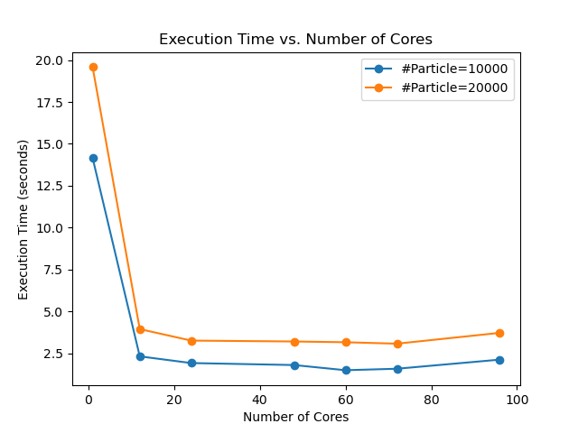

# Exercise 1

### Execution Time

In this first plot, we can see the execution time for both 10,000 and 20,000 particles decreases significantly at first. This is expected because adding more computational resources (cores) allows the work to be divided among more processors, which should reduce the time taken to simulate the same number of particles. However, beyond a certain point, the execution time plateaus, and there is no significant decrease. This is likely due to the fact that now the amount of particles in each ranks drops significantly and thus communication becomes the main bottleneck.

### Speedup

## Expectations from Assignment 6

For Assignment 6, we would have expected the N-body simulation to exhibit sublinear scaling with increasing numbers of cores due to the inherent complexities of the problem. N-body simulations, particularly when they involve complex interactions and are not embarrassingly parallel, do not typically scale linearly with additional computational resources.

This is because as the number of cores increases, the communication overhead and synchronization requirements often increase non-linearly. Furthermore, the use of an octree for speeding up calculations does reduce the computational complexity from O(n^2) to approximately O(n log n), but it also adds overhead due to tree construction and traversal, which can affect scaling behavior.

Therefore, the performance patterns observed in the plots—where the execution time decreases significantly at first with an increase in the number of cores, but then shows a plateau and in the speedup plot, an initial increase followed by a plateau or decline at higher core counts—are consistent with what we expected. These outcomes align with the understanding that while parallelization does provide performance benefits for N-body simulations, it does not do so in a perfectly linear fashion, particularly at higher core counts.

# Exercise 2

## Naive Solution

In a basic N-body simulation where each particle interaction is calculated without regard to spatial locality, the spatial distribution of particles does not directly affect performance. This is because the computation is inherently parallel—the calculation of the force on each particle due to every other particle is independent of the particle positions. Therefore, introducing spatial load imbalance by clustering more particles in specific regions of space would not be expected to significantly affect the performance in this naive implementation. The computational load for each process remains the same since each one still needs to consider all particles for force calculations.

In our case the computation time stayed the same.

| Balanced | Factor 0.5 | Factor 0.1 |
| -------- | ---------- | ---------- |
| 0.711    | 0.731      | 0.728      |

## Octree Solution

When an octree is used in an N-body simulation, the performance becomes sensitive to the spatial distribution of particles. In the octree the particles are subdivided to group nearby particles and thereby optimizes the force calculations by only considering detailed interactions between close neighbors and approximated interactions for distant particles. But since now a significant amount of the particles is close together the tree will be deeper and therefore need longer to calculate the forces.
