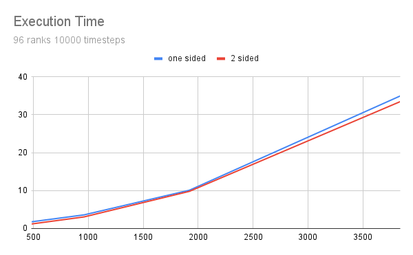
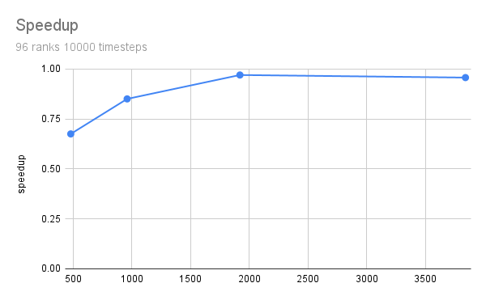
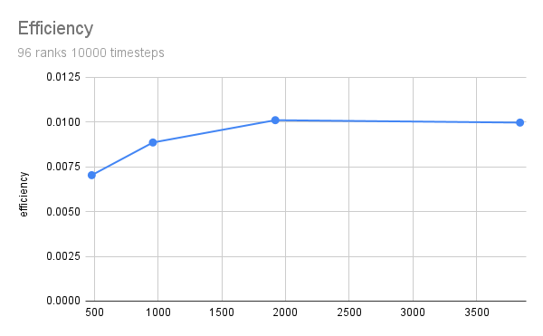
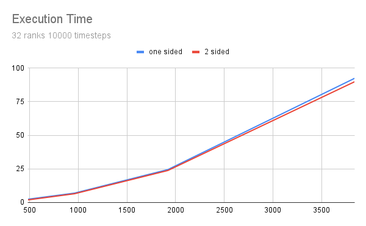
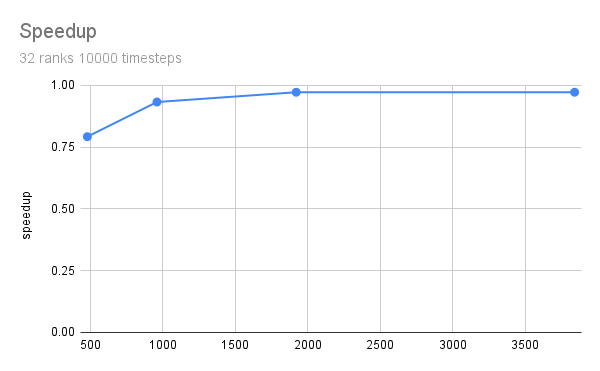
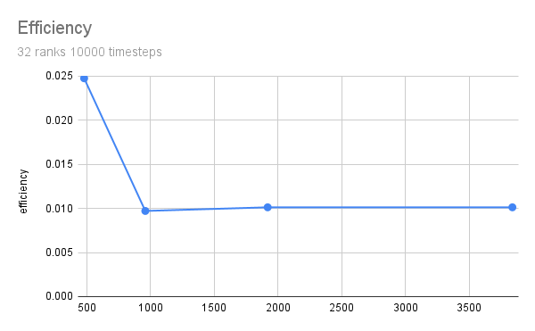

## One Sided Communication Approach

In this implementation, we used MPI Windows to create a shared memory space where each rank can put its updated particle positions. Other ranks can then access this updated data directly from the shared memory window with a `MPI_Get`.

## Benchmarks

Unfortunately the use of one sided Communication did not lead to a speedup wich can be seen in the following charts:

A very similar picture can be found with 32 ranks. But it is noticable that the efficiency is slightly higher.

The results suggest that for this specific N-body simulation, two-sided communication outperforms one-sided communication in terms of execution time. The scalability of the application is limited, as seen from the low efficiency values. However, the relative performance gap between one-sided and two-sided communication decreases with larger problem sizes.

### Measured Data

This is the data for 96 ranks and 10000 timesteps

|            | 480 Praticles | 960 Praticles  | 1920 Praticles | 3840 Praticles |
| :--------- | :------------ | :------------- | :------------- | :------------- |
| one sided  | 1.759         | 3.595          | 10.1           | 34.956         |
| 2 sided    | 1.188         | 3.058          | 9.8            | 33.465         |
|            |               |                |                |                |
| speedup    | 0.6753837408  | 0.8506258693   | 0.9702970297   | 0.9573463783   |
| efficiency | 0.0070352473  | 0.008860686138 | 0.01010726073  | 0.009972358107 |

And for 32 ranks:

|            | 480 Praticles | 960 Praticles | 1920 Praticles | 3840 Praticles |
| :--------- | :------------ | :------------ | :------------- | :------------- |
| one sided  | 2.434         | 6.992         | 24.5           | 92.43          |
| 2 sided    | 1.929         | 6.522         | 23.823         | 89.878         |
|            |               |               |                |                |
| speedup    | 0.7925225965  | 0.9327803204  | 0.9723673469   | 0.9723899167   |
| efficiency | 0.02476633114 | 0.00971646167 | 0.01012882653  | 0.01012906163  |
