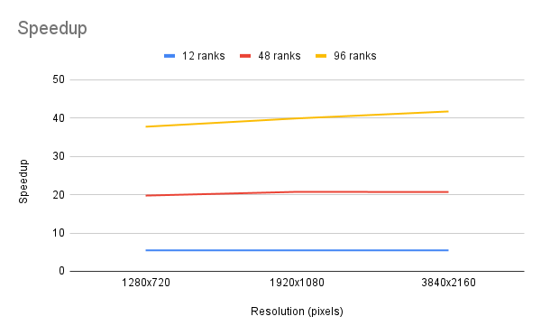

###### This was a collaboration of Hednrik Munske and Florian Neururer

# Exercise 1

## Performance of Parralelization
The naive implementation shows significant improvements in execution time as the number of ranks increases. This is evident from the decreasing execution times across different resolutions as the number of ranks goes from 1 to 96.

The speedup achieved is substantial, as shown in the Speedup table. Particularly, the increase from 1 to 96 ranks demonstrates the parallelization's effectiveness.

### Execution time

|           | 1      | 12     | 48    | 96    |
| --------- | ------ | ------ | ----- | ----- |
| 1280x720  | 9.169  | 1.679  | 0.464 | 0.243 |
| 1920x1080 | 20.632 | 3.769  | 0.995 | 0.517 |
| 3840x2160 | 82.304 | 15.049 | 3.979 | 1.973 |

#### Speedup
|           | 12          | 48          | 96          |
| --------- | ----------- | ----------- | ----------- |
| 1280x720  | 5.460988684 | 19.76077586 | 37.73251029 |
| 1920x1080 | 5.474131069 | 20.73567839 | 39.90715667 |
| 3840x2160 | 5.469067712 | 20.68459412 | 41.71515459 |

#### Efficiency
|           | 12           | 48           | 96           |
| --------- | ------------ | ------------ | ------------ |
| 1280x720  | 0.4550823903 | 0.4116828305 | 0.3930469822 |
| 1920x1080 | 0.4561775891 | 0.4319932998 | 0.4156995487 |
| 3840x2160 | 0.4557556427 | 0.4309290441 | 0.4345328603 |

### How to improve performance
The main way to improve performance is to implment a better load balancing. This is because the naive implementation has to wait for the slowest rank to finish. This means that the other ranks are idle while waiting for the slowest rank to finish. This is a waste of resources. A better load balancing would mean that the other ranks do not have to wait for the slowest rank to finish.

# Exercise 2

## Load Balancing
### Static Load Balancing with Alternating Row Assignment
**Description**: In this approach, the workload (rows of the Mandelbrot set) is statically distributed among all processes at the start of the computation, with rows alternating between different ranks. Each process computes every N-th row where N is the total number of processes, ensuring a round-robin style distribution.

**Advantages**:
- **Simplicity**: The implementation is straightforward as each process knows ahead of time which rows it will compute.
- **No Runtime Overhead for Load Distribution**: Since the workload distribution is decided at the start, there’s no need for runtime adjustments or communication for workload balancing.

**Disadvantages**:
- **Potential for Inefficiency**: Although alternating rows can provide a more even distribution than chunking the image, there could still be inefficiencies. The Mandelbrot set's computational complexity varies across the image, and this static method doesn’t account for that variability.

### 2. Dynamic Load Balancing with Work Stealing
**Description**: Processes dynamically redistribute work during runtime. Idle processes can 'steal' work from busier processes.

**Advantages**:
- More effective utilization of resources.
- Can adapt to uneven workloads and computational complexities.

**Disadvantages**:
- Higher implementation complexity.

### 3. Master-Worker Scheme
**Description**: One process acts as a master to distribute work to worker processes and collect results.

**Advantages**:
- Can be more efficient for certain types of workloads.
- Centralized control over workload distribution.

**Disadvantages**:
- The master process can become a bottleneck.
- Inefficient if the workload is not well-partitioned.

## Implementation
In our case, alternating row assignment in static load balancing offers a more balanced workload compared to dividing the image into contiguous blocks, which was then the strategy chosen to implement.

### Execution time
The comparison between the naive and load-balanced implementations of the Mandelbrot set calculation demonstrates the importance of effective workload distribution in parallel computing. While the naive approach benefits significantly from increasing the number of ranks, its performance is further enhanced by implementing a static load-balancing strategy.

This was done with 96 ranks:

|           | Naive | Load Balanced |
| --------- | ----- | ------------- |
| 1280x720  | 0.243 | 0.187         |
| 1920x1080 | 0.517 | 0.344         |
| 3840x2160 | 1.973 | 0.974         |
