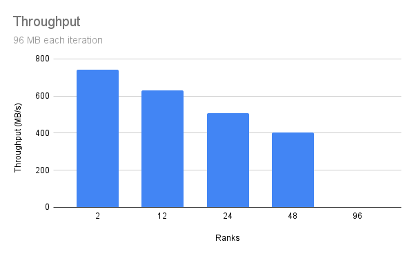

Team collaboration of Hendrik Munske and Florian Neururer

## Task 1

## Task 2

In order to benchmark this hybrid implementaion a total size which
will be written and read each iteration was set and then the appropriate
size per rank was calculated to calculate the throughput.

##### Size 96 MB

| Ranks | Time (s) | Throughput (MB/s) | Per Rank (MB) |
| ----- | -------- | ----------------- | ------------- |
| 2     | 1.03732  | 740.3694135       | 48            |
| 12    | 1.215242 | 631.972891        | 8             |
| 24    | 1.517224 | 506.1876163       | 4             |
| 48    | 1.895862 | 405.0927757       | 2             |

##### Size 768 MB

| Ranks | Time (s) | Throughput (MB/s) | Per Rank (MB) |
| ----- | -------- | ----------------- | ------------- |
| 2     | 7.395086 | 103.8527476       | 384           |
| 12    | 8.07783  | 95.07503872       | 64            |
| 24    | 8.701488 | 88.26076643       | 32            |
| 48    | 9.251836 | 83.01055055       | 16            |

##### Size 3072 MB

| Ranks | Time (s)  | Throughput (MB/s) | Per Rank (MB) |
| ----- | --------- | ----------------- | ------------- |
| 2     | 61.810429 | 49.70035073       | 1536          |
| 12    | 66.134502 | 46.45079205       | 256           |
| 24    | 69.127385 | 44.43969637       | 128           |
| 48    | 69.269404 | 44.34858426       | 64            |

##### Size 6144 MB

| Ranks | Time (s)   | Throughput (MB/s) | Per Rank (MB) |
| ----- | ---------- | ----------------- | ------------- |
| 2     | \-         |                   | 3072          |
| 12    | 112.308076 | 54.70666241       | 512           |
| 24    | 114.58308  | 53.62048219       | 256           |
| 48    | 118.760866 | 51.73421352       | 128           |

##### Observations

1. **Collective Call Overhead**: When we increase the number of ranks , each rank participates in collective operations. As the number of ranks increases, the overhead associated with coordinating these operations and transferring data between processes also increases. 

2. **Impact on Throughput with Smaller Data Sizes**: This is because the fixed overhead of communication becomes more pronounced relative to the actual data transfer time.

