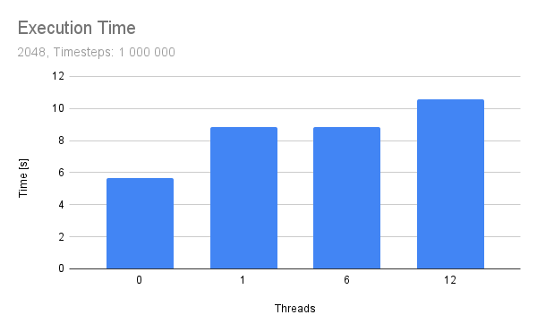

Team collaboration of Hendrik Munske and Florian Neururer

### Exercise 1

##### Bechmarks

The following table shows the execution time for different thread numbers and different domain sizes whereas the number of timesteps is kept constant at 50000.

|     | 2048     | 4096     | 8192     | 16384    |
| --- | -------- | -------- | -------- | -------- |
| seq | 0.286218 | 0.57147  | 1.14433  | 1.95941  |
| 1   | 0.417417 | 0.643766 | 1.15388  | 2.14773  |
| 6   | 0.399033 | 0.461346 | 0.532772 | 0.80647  |
| 12  | 0.428668 | 0.495899 | 0.532201 | 0.676074 |

In the next table the domain size is kept constant at 2048 but the number of timesteps ist set to 1000000.
Looking at this result it becomes obvious that the implementation does not scale at all with the number of timesteps.

|     | 1 000 000 |
| --- | --------- |
| seq | 5.67647   |
| 1   | 8.84847   |
| 6   | 8.86245   |
| 12  | 10.596    |

Speedup from the sequential version to the version with 12 threads with 50 000 timesteps and varying domain size.

| 2048         | 4096        | 8192        | 16384       |
| ------------ | ----------- | ----------- | ----------- |
| 0.6676915468 | 1.152391919 | 2.150183859 | 2.898218242 |

We can observe that the sycl implementation does scale in general poorly and the effects of the parallelization only start to apper after a domain size larger than 4096.

###### Visualization

In the following charts 0 threads indicates that this is from the provided sequential implementation.

### Exercise 2

##### Bechmarks

If we now again measure different domain sizes with this new version where intermediate prints exist we receive the following results:

|    | 2048     | 4096     | 8192     | 16384    |
| -- | -------- | -------- | -------- | -------- |
| 1  | 0.449938 | 0.758039 | 1.2898   | 2.16916  |
| 6  | 0.425163 | 0.443294 | 0.510858 | 0.684984 |
| 12 | 0.52675  | 0.472854 | 0.60718  | 0.680603 |

We can clearly see that now there is a consinste all be it small decrease in performance.

###### Visualization

